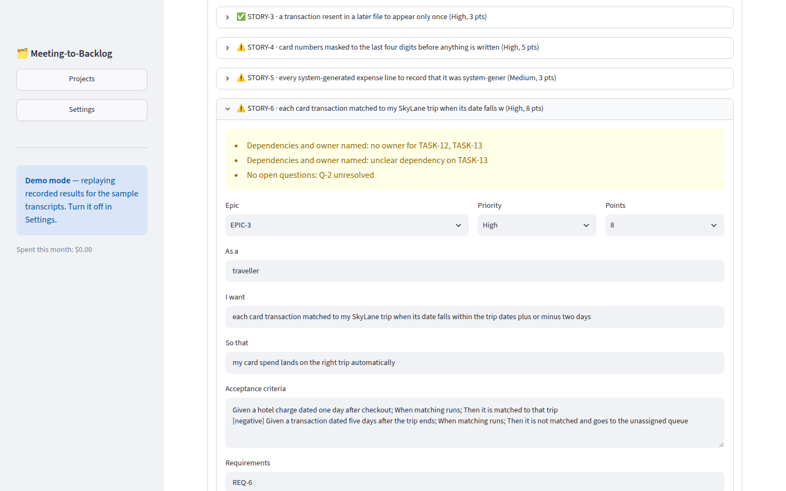
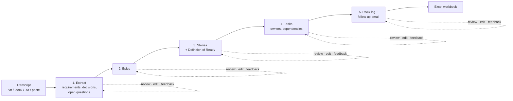
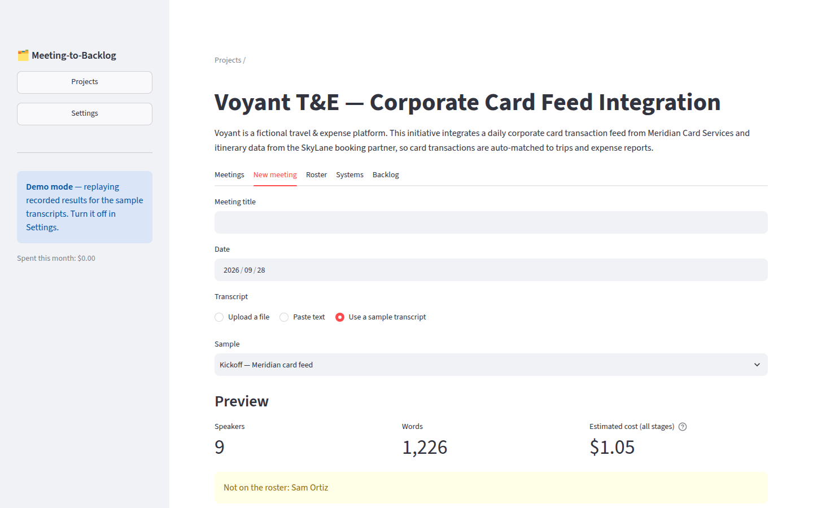
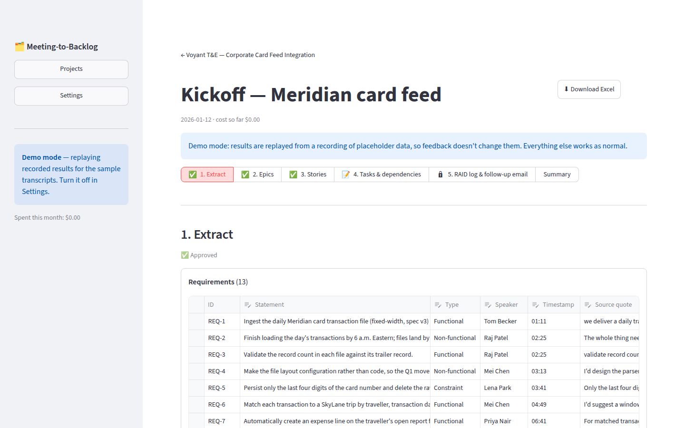
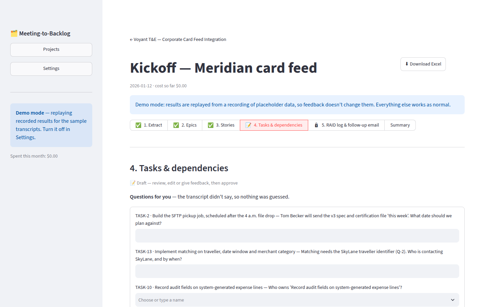
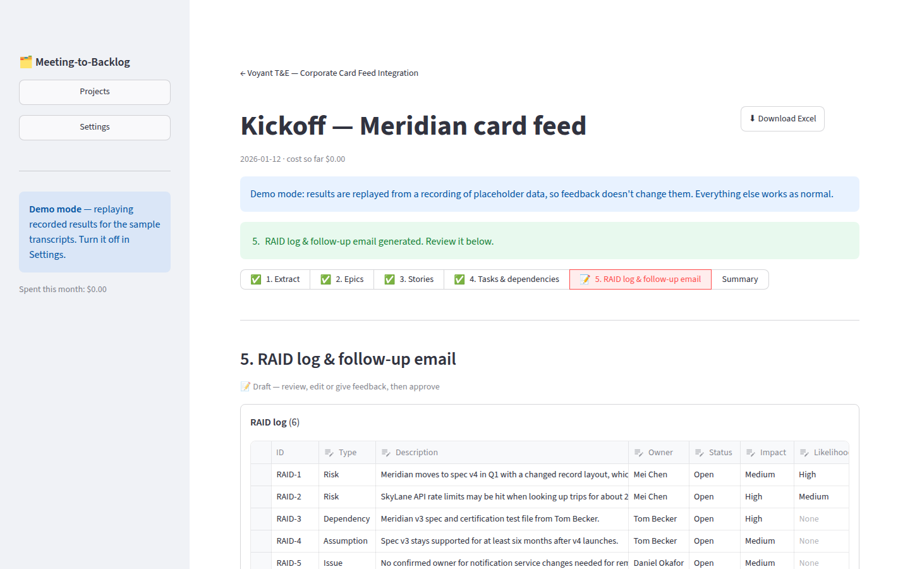
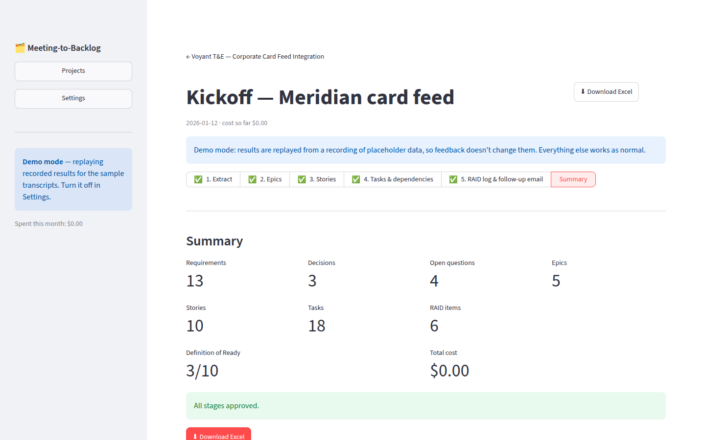

# Meeting-to-Backlog

**Turn a stakeholder meeting transcript into a delivery-ready backlog (epics, stories with acceptance criteria, tasks with owners and dependencies), plus a RAID log and a follow-up email. You review and refine each stage, then export everything to Excel.**



> **About the data.** Everything in this repo is fictional: the company, the people, the partners and the transcripts. The results in the screenshots, the demo mode and the sample Excel file are **hand-written placeholders** that show the intended output. They are not recorded model output. Real runs replace them with `python scripts/run_sample.py --record`.

---

## The problem

On an integration team, requirements arrive in stakeholder calls. Turning a call into backlog items is manual:

1. Re-read the transcript several times to pull out requirements, decisions and open questions.
2. Split them into epics, then stories, then tasks.
3. Write acceptance criteria, then work out dependencies and owners.

This takes **3–5 hours a week**. The stories that come out of it often go back and forth in refinement because acceptance criteria, owners or dependencies are missing.

**Goal:** cut the time to **under 2 hours a week** and raise the share of stories that are ready on the first pass. The full evaluation, including options and risks, is in [docs/evaluation.md](docs/evaluation.md).

## What it does



Each stage follows the same loop: **generate → review → edit or comment → regenerate → approve**. A later stage runs only on approved input, so a mistake is caught where it happens instead of spreading downstream.

| | |
|---|---|
|  **Add a meeting.** Before anything is spent, the app shows the speakers, the length and an estimated cost, and flags anyone not on the project roster. |  **Extract.** Each requirement carries a quote from the transcript, and the app checks that the quote actually appears there. |
|  **Stories.** Each story is checked against a 7-point Definition of Ready. Failures are listed on the story. |  **Tasks.** When the transcript doesn't name an owner or settle a dependency, the app asks you instead of guessing. |
|  **RAID log and follow-up email.** Both are generated from the approved backlog and are ready to copy. |  **Summary and export.** Counts, pass rate and cost, with a one-click Excel download. |

**Excel output** ([sample](samples/output/kickoff-export-placeholder.xlsx)): one workbook per meeting.
- **Tabs:** Summary, Requirements, Decisions, Epics, Stories, Tasks, RAID, Open Questions and Follow-up Email, linked by IDs.
- **Flags:** stories that fail the Definition of Ready are shaded, and missing owners show as TBD.
- **Summary counts** are live formulas, so they stay correct when rows are edited in Excel.

## Key product decisions

| Decision | Why |
|---|---|
| **Review at every stage, not one pass** | One-pass tools (Copilot recaps, Jira AI) give a draft you then fix by hand. Reviewing each stage keeps errors from compounding, and the product manager stays the decision-maker. |
| **Never guess owners or dependencies** | A wrong owner is worse than a blank one. Missing information becomes a question for the product manager. |
| **Every requirement cites the transcript** | The quote is checked against the transcript text, so invented requirements are flagged. |
| **Definition of Ready as the quality metric** | "Better stories" becomes measurable: the first-pass pass rate. Size, acceptance-criteria and owner checks run in code, so they're consistent. Clarity, independence and testability are judged by the model. |
| **Flag, don't block** | A failing story can still be approved and exported. The product manager decides; the tool informs. |
| **Your edits are locked** | When you regenerate after editing, your edited items are sent as locked and put back if the model changes them. |
| **The app assigns IDs** | IDs such as `REQ-4` and `STORY-2` stay stable across edits, regenerations and meetings. That keeps cross-tab links valid and makes change detection possible later. |
| **Excel, not direct Jira integration (for now)** | It works without company system access, and Excel is where the backlog gets reviewed anyway. Jira CSV import is on the roadmap. |
| **Cost is visible** | An estimate before each run, the actual cost of every call, and an optional monthly cap. |
| **Demo mode** | Anyone can try the full flow without an API key. |

## Scope

| Release | Scope | Status |
|---|---|---|
| MVP | Extract → epics → stories → tasks, RAID log, follow-up email, Excel export, demo mode | Built |
| Release 2 | **Change detection:** compare a new meeting with the saved backlog and flag new, changed and dropped scope | Planned; the [follow-up sample transcript](samples/transcripts/02-follow-up.txt) is written to test it |
| Release 2 | Release notes and stakeholder updates from completed stories | Planned |
| Release 2 | Test cases from acceptance criteria | Planned |
| Next | Jira CSV import format; an evaluation set that scores extraction coverage and Definition of Ready pass rate | Planned |

## Measuring success

| Metric | Baseline | Target | Result |
|---|---|---|---|
| Hours from meeting to finished backlog | 3–5 hrs/week | < 2 hrs/week | Pending pilot |
| Stories passing Definition of Ready on first pass | To be measured | +30 points | Pending pilot |
| Model cost per meeting | — | ≈ $1–2 (Opus) or less (Sonnet); estimated, not yet measured | Pending pilot |

## Try it

```bash
python -m venv .venv && source .venv/bin/activate
pip install -r requirements.txt
streamlit run app/main.py
```

1. Click **Try demo mode** in the sidebar. No API key or cost is needed.
2. Click **Load sample project**, then open it.
3. Under **New meeting**, choose **Use a sample transcript**, then **Create meeting**.
4. Generate and approve each stage, then **Download Excel**.

To process your own transcripts, turn off demo mode and add an Anthropic API key in **Settings**. The key is stored only in your local `.env` file.

## How it's built

| Layer | Choice |
|---|---|
| UI | Streamlit, running locally |
| Model | Claude API (Opus 5 or Sonnet 5, selectable), structured output validated against Pydantic schemas |
| Cost control | The project context and transcript are cached once and reused by every stage; cost is tracked per call |
| Storage | SQLite (projects, meetings, every version of every stage, feedback) |
| Export | openpyxl |
| Tests | 78 pytest tests: the model is faked, and the UI is driven headlessly with Streamlit's AppTest |

Details: [requirements](docs/requirements.md) · [user journey](docs/user-journey.md) · [technical design](docs/technical-design.md).

```
app/        Streamlit screens
core/       parsing, schemas, prompts, Claude client, pipeline, DoR checks, export, demo replay
samples/    fictional project, transcripts, demo recording, sample Excel output
scripts/    run_sample.py: end-to-end run with the real API (--record saves demo data)
tests/      unit, pipeline, export and UI tests
docs/       evaluation, requirements, user journey, technical design, screenshots
```

```bash
pytest   # no API key needed
```
