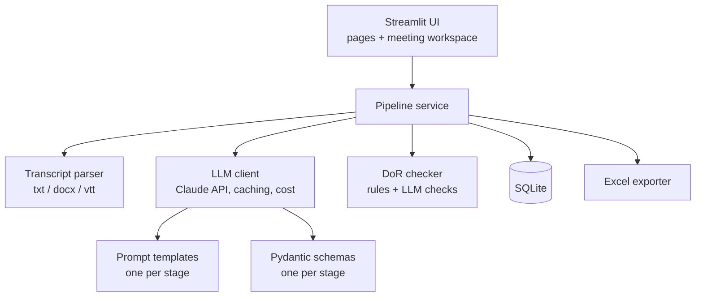

# Technical Design — Meeting-to-Backlog Assistant

Status: Draft for review · Based on [requirements.md](requirements.md) and [user-journey.md](user-journey.md)

## 1. Stack

| Layer | Choice | Why |
|---|---|---|
| UI | **Streamlit** (Python) | A local web app with little code; editable tables through `st.data_editor` |
| LLM | **Claude API**, official `anthropic` Python SDK | Model set in Settings: `claude-opus-5` or `claude-sonnet-5` |
| Structured output | `client.messages.parse()` with **Pydantic** schemas | Every stage returns validated JSON, not free text |
| Storage | **SQLite** (Python standard library) | One local file; no server |
| Transcript parsing | Standard library for `.txt` and `.vtt`; `python-docx` for `.docx` | |
| Excel | **openpyxl** | Formatting, colours for DoR flags, frozen headers |
| Tests | **pytest** | LLM calls mocked in unit tests |

Everything is free and open source. The only paid component is Claude API usage.

## 2. Architecture



The UI only calls the **pipeline service**. The service is plain Python with no Streamlit imports, so it can be tested directly and a different UI could be added later.

## 3. Pipeline stages

Every stage has the same contract:

```
input:  transcript + roster/systems + approved outputs of earlier stages
        + current items (on regenerate) + user feedback
output: Pydantic model for that stage (validated)
```

| # | Stage | Output schema (key fields) |
|---|---|---|
| 1 | Extract | `Requirement[]` (statement, type, source_quote, speaker, timestamp), `Decision[]`, `OpenQuestion[]` |
| 2 | Epics | `Epic[]` (title, description, requirement_ids) |
| 3 | Stories | `Story[]` (epic_id, as_a, i_want, so_that, acceptance_criteria[given, when, then], priority, points) |
| 4 | Tasks | `Task[]` (story_id, description, owner or `null`, dependency_ids, system), `MissingInfo[]` (questions for you) |
| 5 | RAID + email | `RaidItem[]` (all RAID fields), `FollowUpEmail` (subject, body sections) |

### Key design decisions

- **The app assigns IDs, not the model.** IDs (`REQ-1`, `EPIC-2`, and so on) are generated in code and passed back on regenerate, so edits and cross-tab links stay stable.
- **Regenerate respects your edits.** Items you edited are sent as locked, and the prompt tells the model to keep them unchanged.
- **Missing owners are never guessed.** The schema allows `owner: null`. Each `null` becomes a question in the Stage 4 form.
- **Every item carries its source.** Stage 1 items include a quote from the transcript. The app checks that the quote actually appears in the transcript and flags it if it doesn't.
- **Out-of-date stages are tracked.** Each approved stage stores a hash of its inputs. When an earlier stage changes, the hashes no longer match, so the later stages are marked stale.

## 4. LLM client

- **Prompt caching.** The system prompt, project context and transcript form a fixed prefix marked with `cache_control`. Stages 2–5 reuse that cached prefix, which cuts input cost on every call after the first.
- **Cost tracking.** Cost is calculated from `response.usage` (input, output and cached tokens) using a price table in `config.py`. It's stored per call and shown for each stage and each meeting.
- **Cost estimate before running**, based on a token count of the transcript and a multiplier for each stage.
- **Retries.** The SDK retries 429 and 5xx errors automatically. If a call still fails, the app shows a message and the stage stays in its previous state.
- **Refusals.** The app checks `stop_reason` before reading the output and shows a message if the model declined.
- **Long transcripts.** Current models accept around 1M tokens, so any single meeting fits in one call. Section-by-section processing is not needed for the MVP; the app just warns above a set size.

## 5. Definition of Ready checker

This is a mix of code checks and model checks, so the results are reliable and consistent from run to run.

| Check | How it's checked |
|---|---|
| Small (≤ 8 points) | Code |
| At least 2 acceptance criteria, including one negative case | Code checks the count; the model marks which criteria are negative |
| Dependencies and owner named | Code: no `null` owners on the story's tasks |
| No open questions | Code: no unresolved `OpenQuestion` linked to the story |
| Clear statement, independent, testable | Model review: one call per stage that returns pass/fail and a reason for each story |

## 6. Data model (SQLite)

```
project(id, name, description, created_at)
person(id, project_id, name, role, team)
system(id, project_id, name, description)
meeting(id, project_id, title, date, transcript_text, source_format, status, created_at)
stage_run(id, meeting_id, stage, status[draft|approved|stale], output_json,
          input_hash, model, input_tokens, output_tokens, cached_tokens, cost_usd, created_at)
feedback(id, stage_run_id, item_id NULL, text, created_at)
backlog_item(id, project_id, meeting_id, type[epic|story|task|raid], item_key, data_json, status)
```

- `stage_run` keeps a record of every version of each stage.
- `backlog_item` holds the project's **current** backlog, which change detection compares against in Release 2.

## 7. Excel export

One workbook, built from the approved (or latest draft) output of each stage:

- **Tabs:** Summary, Requirements, Epics, Stories, Tasks, RAID, Open Questions, Follow-up Email.
- **Formatting:** header row frozen and filterable; column widths set.
- **Flags:** stories failing the DoR have a highlighted row and a "DoR failures" column.
- **Links:** IDs match across tabs.

## 8. Repo structure

```
app/
  main.py                 # Streamlit entry point
  pages/                  # Settings, Projects, Project, Meeting workspace
core/
  config.py               # models, prices, limits
  parsing.py              # txt / docx / vtt → Transcript
  schemas.py              # Pydantic models per stage
  prompts/                # one template per stage
  llm.py                  # Claude client, caching, cost
  pipeline.py             # stage orchestration, staleness
  dor.py                  # Definition of Ready checker
  storage.py              # SQLite
  export.py               # Excel
samples/
  project.json            # fictional roster + systems
  transcripts/            # kickoff + follow-up (fictional)
tests/
docs/
.env.example              # ANTHROPIC_API_KEY=
requirements.txt
README.md                 # case study
```

## 9. Testing

- **Unit tests:** parsers (a sample file of each format), DoR code checks, ID assignment, stale detection, Excel export, and the storage layer. The LLM is mocked, so tests are free and repeatable.
- **Recorded fixtures:** real model output for the sample transcripts, saved as JSON. The app can replay these in a **demo mode** without an API key, which is useful for the GitHub showcase.
- **Quality check (after MVP):** a small evaluation set built from the sample transcripts, scored on requirements coverage and DoR pass rate.

## 10. Security

- The API key lives only in `.env`, which `.gitignore` excludes from the repo.
- Only fictional sample data is included in the repo.
- Nothing is sent anywhere except the Claude API.

## 11. Build plan

| Milestone | Scope |
|---|---|
| M1 Foundation | Repo setup, config, parsers, schemas, storage, tests |
| M2 Pipeline | LLM client, prompts for Stages 1–5, DoR checker, stale tracking |
| M3 UI | Settings, projects, meeting workspace with the stage stepper |
| M4 Export + samples | Excel export, fictional transcripts, recorded fixtures, demo mode |
| M5 Showcase | README case study, screenshots or GIF, sample Excel file |
| R2 | Change detection, release notes and stakeholder updates, test cases |
