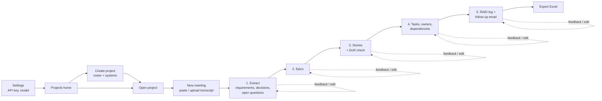

# User Journey — Meeting-to-Backlog Assistant

Status: Draft for review · Based on [requirements.md](requirements.md)

**Persona:** A product manager on an integration team. They run several stakeholder meetings a week and turn each one into a Jira-ready backlog.

## Overview

Each stage follows the same loop: **generate → review → edit or give feedback → regenerate or approve → next stage**. Progress is saved after every stage, and you can export to Excel at any point.

---

## J0. First-time setup (once)

| Step | You do | App does |
|---|---|---|
| 1 | Install and launch the app locally | Opens in the browser |
| 2 | Paste your Anthropic API key in **Settings** | Checks the key with a test call and saves it to the local `.env` file |
| 3 | Pick the default model (Opus 5 or Sonnet 5) and an optional monthly cost cap | Saves the settings |

## J1. Create a project (once per initiative)

| Step | You do | App does |
|---|---|---|
| 1 | Click **New project**, enter a name and a short description | Creates the project |
| 2 | Add a roster: each person's name, role and team | Uses it to match owners |
| 3 | Add systems and partners (e.g. "Card feed service", "Booking partner API") | Uses them to find dependencies |
| 4 | *(Optional)* Load the sample project | Loads the fictional demo project and transcripts |

## J2. Process a meeting (core MVP flow)

### Step 1: Add the meeting
- **You:** choose a project, click **New meeting**, enter the title and date, then paste text or upload a `.txt`, `.docx` or `.vtt` file.
- **App:** parses the file and shows a preview: speakers detected, length, and an **estimated cost** for the selected model. Attendees are pre-filled by matching speakers to the roster, and speakers who aren't on the roster are flagged.
- **You:** confirm.

### Step 2: Extract (Stage 1)
- **App:** lists requirements, decisions and open questions. Each item shows its **source quote, speaker and timestamp**.
- **You:** edit, delete or add items inline, or type feedback (e.g. "REQ-4 and REQ-7 are the same", "ignore the reporting discussion, out of scope"), then regenerate. Click **Approve** when it's right.

### Step 3: Epics (Stage 2)
- **App:** groups the approved requirements into epics. Any requirement not assigned to an epic is highlighted.
- **You:** rename, merge or split epics, or move requirements between them, by editing directly or giving feedback. Then approve.

### Step 4: Stories (Stage 3)
- **App:** writes stories under each epic. Each has the user story statement, Given/When/Then acceptance criteria, High/Med/Low priority and Fibonacci points. Each story also gets a **Definition of Ready badge**: a pass, or a list of the checks it failed (e.g. "only 1 AC", "13 pts → consider splitting").
- **You:** edit or give feedback, per story or for the whole stage. Failing stories can still be approved; they stay flagged.
- **App:** shows the overall pass rate, e.g. "DoR: 9/12 stories pass".

### Step 5: Tasks and dependencies (Stage 4)
- **App:** breaks stories into tasks and assigns owners from the transcript and the roster. It lists dependencies between tasks and on systems.
- **Missing info:** when the app can't find an owner or a dependency detail, it asks you in a short form (e.g. "Who owns *Map card transaction fields*?" with a roster dropdown) rather than guessing.
- **You:** answer, edit, then approve.

### Step 6: RAID log and follow-up email (Stage 5)
- **App:** generates both from the approved backlog and the transcript.
  - **RAID log:** type, description, owner, status, impact, likelihood, mitigation, due date, and the linked epic or story.
  - **Email:** summary, decisions, action items with owners and due dates, and open questions.
- **You:** edit or give feedback, copy the email to your mail client, then approve.

### Step 7: Export
- **App:** shows a summary (item counts, DoR pass rate, actual cost of the run) and a **Download Excel** button.
- **Result:** one workbook with the tabs listed in requirements §7.

## J3. Come back to a meeting later
- The project page lists meetings with their status (e.g. "Stage 3 of 5"). Opening one takes you back to where you left off.
- If you **change an earlier stage that was already approved**, the stages after it are marked **stale**. The app offers to regenerate them and keeps any edits you made that still apply.

## J4. Release 2 journeys (summary)

| Journey | Flow |
|---|---|
| **Change detection** | Add a new meeting to an existing project → after Extract, a **diff view** shows new, changed and dropped scope against the saved backlog → you accept or reject each change → the backlog is updated → the Excel file gets a **Changes** tab |
| **Release notes and stakeholder update** | Project backlog → select completed stories → generate release notes and a stakeholder update → edit → copy or export |
| **Test cases** | Select stories → generate test cases from their acceptance criteria (steps, expected result, positive and negative) → edit → **Test Cases** tab |

---

## Edge cases and errors

| Situation | App behaviour |
|---|---|
| Transcript too long for one call | Warns you and processes it in sections, then merges the results |
| No requirements found | Says so and suggests checking the file or adding context |
| API error or rate limit | Retries automatically, then shows a clear message; nothing already approved is lost |
| Estimated cost above the cap | Asks you to confirm or switch to Sonnet 5 |
| Unsupported file or empty file | Shows a validation message before any API call |
| Speaker not on the roster | Flagged at Step 1; you can add them to the roster in one click |

## Screens (for the MVP)

1. **Settings:** API key, default model, cost cap.
2. **Projects home:** list of projects and a **New project** button.
3. **Project page:** roster, systems, meetings list, current backlog.
4. **Meeting workspace:** stage stepper (1–5), editable tables, feedback box, Regenerate and Approve buttons, running cost.
5. **Export summary:** counts, DoR pass rate, cost, **Download Excel** button.

## Assumptions to confirm

1. Feedback can be given **per item and for the whole stage**.
2. Editing an approved earlier stage marks the later stages stale; nothing is regenerated without your confirmation.
3. RAID log and email are generated together in Stage 5, after tasks are approved.
